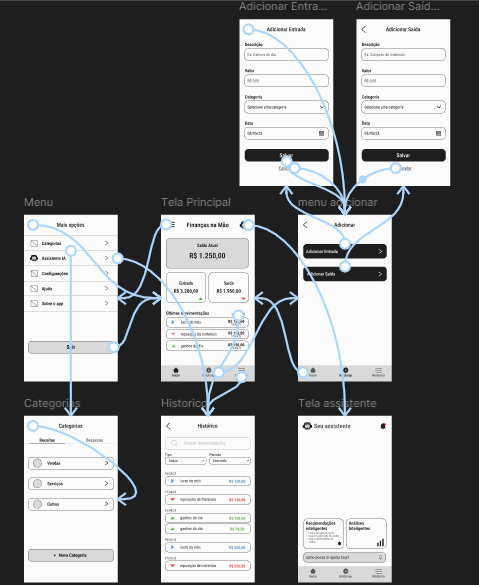

# Finanças na Mão
Aplicativo de gerenciamento financeiro simples desenvolvido para auxiliar pequenos empreendedores e trabalhadores autônomos no controle de entradas, saídas e organização financeira.

## Objetivo
O projeto foi desenvolvido com foco em acessibilidade e simplicidade, permitindo que usuários com diferentes níveis de familiaridade tecnológica consigam organizar suas finanças de forma prática.

## Público-alvo
- Pequenos empreendedores
- Trabalhadores autônomos
- Prestadores de serviço
- Pessoas com dificuldade em organização financeira

## Funcionalidades
- Registro de entradas
- Registro de saídas
- Histórico financeiro
- Categorias
- Controle de saldo
- Interface simples e acessível

## Metodologia
O projeto foi organizado utilizando Scrum, com divisão de tarefas em Sprints e gerenciamento através do Trello.

## Wireframe
Wireframe desenvolvido no Figma com foco em simplicidade, acessibilidade e usabilidade, utilizando poucas cores para representar de forma visual as funcionalidades principais do sistema.
Na imagem a seguir está sendo apresentado o protótipo inicial do aplicativo com o fluxo de funcionamento.

## Organização das tarefas
As atividades foram organizadas utilizando Trello.

## Ferramentas utilizadas
- Figma
- Trello
- GitHub
- Scrum
- VsCode

## Funcionalidades implementadas no mvp
Além das funcionalidades iniciais, foi desenvolvido um protótipo funcional em Python para simular o comportamento do sistema. O protótipo permite a interação do usuário por meio do terminal, demonstrando a lógica de funcionamento do aplicativo.

### As funcionalidades implementadas incluem:
- Cadastro de entradas financeiras
- Cadastro de saídas financeiras
- Atualização automática do saldo
- Histórico das últimas transações realizadas
- Simulação de análise financeira
- Assistente virtual com respostas em linguagem simples
- Recomendações financeiras automáticas
- Comparação de gastos entre períodos
- Identificação de categorias com maiores gastos
- Sugestões de organização financeira

## Assistente Inteligente
Foi desenvolvido um módulo de assistente financeiro com o objetivo de auxiliar o usuário na interpretação de suas informações financeiras de forma simples e acessível.

### O assistente oferece respostas automáticas relacionadas a:
- Análise de gastos
- Comparação de períodos financeiros
- Identificação de padrões de consumo
- Sugestões de economia
- Organização financeira básica
- Oportunidades de vendas relacionadas a datas comemorativas

As mensagens foram elaboradas utilizando linguagem simples, evitando termos técnicos e financeiros complexos, tornando o sistema mais acessível para diferentes perfis de usuários.

  

Desenvolvido com ♡ por Karoliny Rufino.

